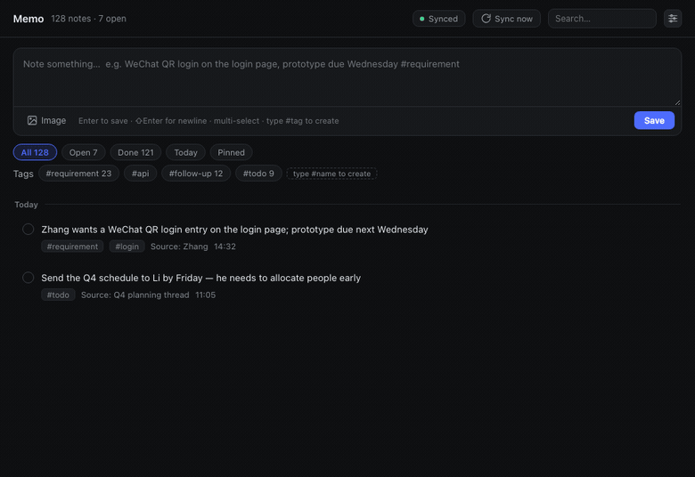
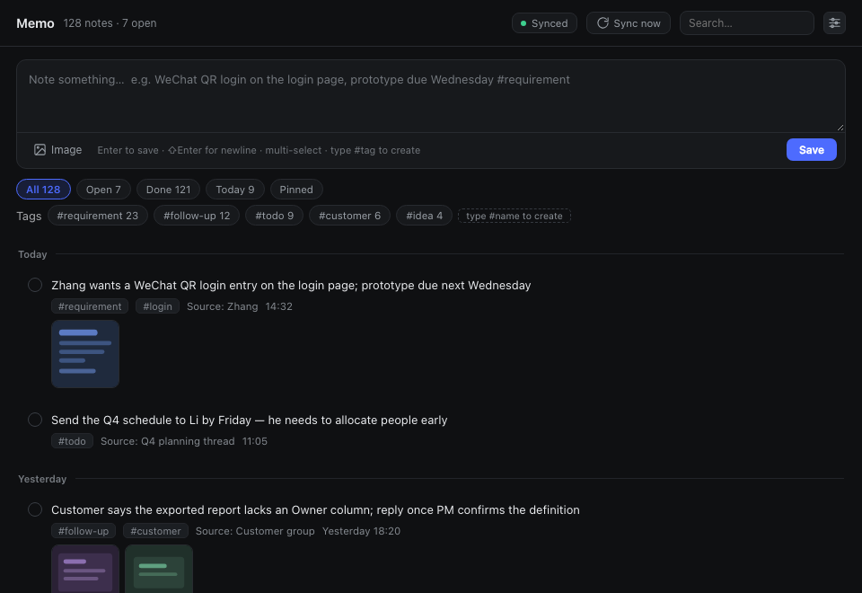
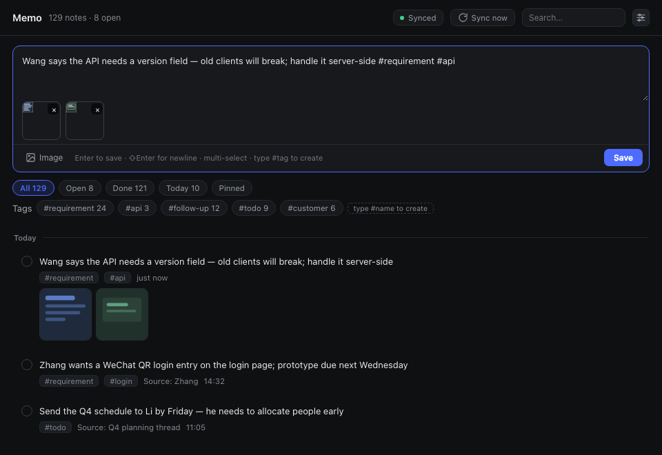
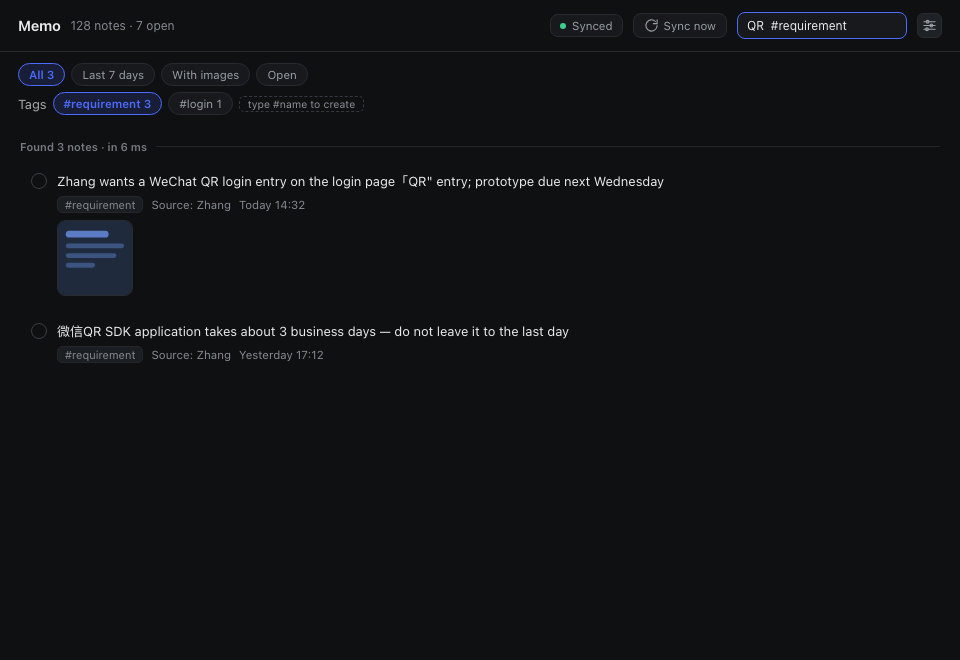
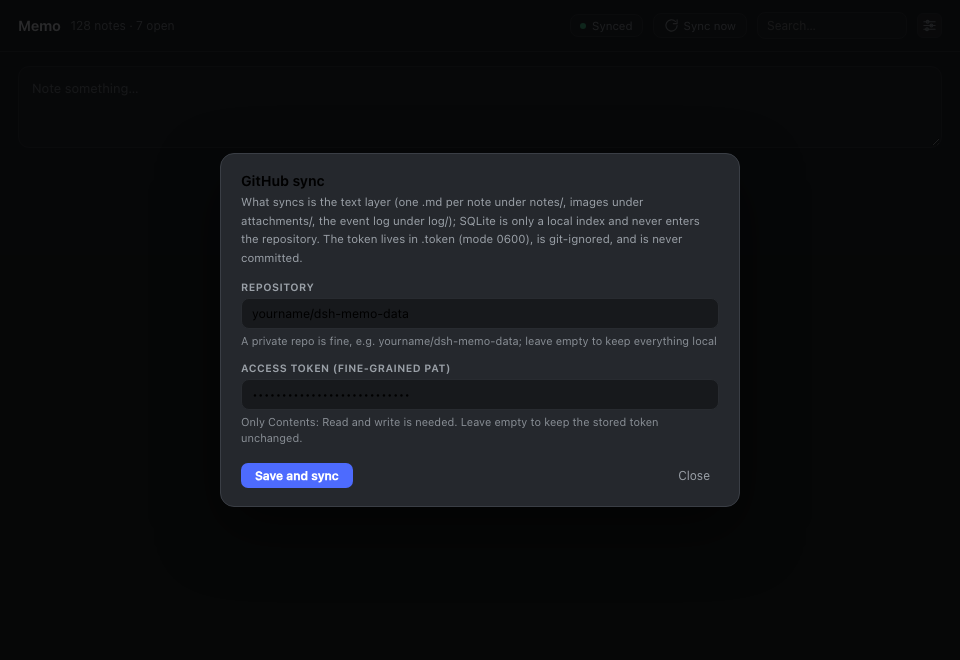

# dsh-memo

[中文](README.zh-CN.md) | **English**

**A memo/scratchpad plugin for DeepSeek Harness** — sidebar entry with quick capture, local SQLite storage, sync to a private GitHub repository, and image/screenshot support.

> Built for the moment a requirement changes mid-conversation: **capture it in seconds, find it later, keep the context, never lose it.**

<p align="center">
  <br>
  <sub>Type it, press Enter — thirty seconds later it is in your private GitHub repository</sub>
</p>

| Main panel | Capturing with images |
|:---:|:---:|
| [](docs/images/en/panel.png) | [](docs/images/en/compose.png) |
| **Search across everything** | **GitHub sync settings** |
| [](docs/images/en/search.png) | [](docs/images/en/settings.png) |


---

## Features

| | |
|---|---|
| **Sidebar entry** | Bottom-rail icon next to Settings, with an open-items badge; click to switch to the memo panel |
| **Quick capture** | Always-present input at the top of the panel; `Enter` saves; the box is drag-resizable |
| **Images & screenshots** | `⌘V` paste / drag-and-drop / file picker (multi-select); content-hash deduplicated, one copy per image |
| **Tags** | Type `#anything` in the body and it is created automatically — not a fixed whitelist |
| **Search** | CJK-safe substring search plus `#tag` / `source:` / `after:` / `before:` / `has:image` / `is:open` qualifiers |
| **Local storage** | `node:sqlite` (built into Node) — **zero external dependencies**, no native module compilation |
| **GitHub sync** | Auto-pushes the text layer to a private repo (30s debounce), plus daily compact SQLite snapshots |
| **No build step** | The client half is a hand-written module bundle using `React.createElement` — edit and refresh |

---

## Installation

### Requirements

- DeepSeek Harness (dsh) **0.2.0-rc.2 or newer**
- Its bundled Node **≥ 22.5** (the minimum for `node:sqlite`; dsh's Electron usually ships 24.x)
- No third-party runtime dependencies, no `npm install` needed

### Option 1: Install from GitHub

```sh
dsh plugin --profile <your-profile> add github:adamcjm/dsh-memo
```

`<your-profile>` is your dsh profile name (e.g. `web`, `tui`). **Restart dsh** afterwards.

### Option 2: Install for local development

```sh
git clone https://github.com/adamcjm/dsh-memo.git
dsh plugin --profile <your-profile> add link:/path/to/dsh-memo
```

With `link:` your edits are live (refresh the page for client changes; restart for host changes).

### Option 3: Manual wiring (desktop profile only)

**The `desktop` profile is owned exclusively by the dsh desktop app and the CLI refuses to write to it** (it reports `profile "desktop" is managed exclusively by the Electron application`). Wire it manually:

1. Edit `~/.dsh/profiles/desktop/package.json`:

   ```jsonc
   {
     "dsh": {
       "profile": {
         "bundles": [
           // ... existing bundles ...
           "dsh-memo"                                // ← add
         ]
       }
     },
     "dependencies": {
       // ...
       "dsh-memo": "link:/absolute/path/to/dsh-memo" // ← add
     }
   }
   ```

2. Install dependencies (creates the symlink):

   ```sh
   cd ~/.dsh/profiles/desktop
   pnpm install
   ```

3. **Restart DeepSeek Harness.**

### Verifying the install

```sh
dsh --profile <profile> --dump-config | grep -A3 "id: memo"
```

Or just look at the UI: a **Memo** icon should appear at the bottom of the sidebar.

---

## Usage

### Capturing a note

Open the **Memo** icon at the bottom of the sidebar and type into the input at the top, then press `Enter`:

```
Mr. Zhang wants a WeChat QR login entry on the login page; prototype due next Wednesday #requirement-change #login
```

`#requirement-change` and `#login` become tags automatically, and the tag markers are stripped from the body.

### Adding images / screenshots

Three ways, freely mixable and repeatable:

- **Paste** — take a screenshot, then press `⌘V` in the input
- **Drag** — drag images straight from Finder onto the input
- **Pick** — click the "Image" button; hold `⌘` / `⇧` in the file dialog for multi-select

Images are named by SHA-256 and stored in `attachments/`, so **pasting the same image twice costs one copy**. Click a thumbnail to view it full size.

### Tags

Tags are **not fixed**. The defaults (`#requirement-change` `#todo` `#follow-up` `#idea` `#meeting`) are just starting suggestions:

- Type `#customer-A` or `#MrZhang` in the body and save → the tag is created and attached to that note
- The tag area is sorted by usage; click one to filter
- A tag that no note uses anymore disappears on its own

### Search

Use the search box in the panel header and press `Enter`. Qualifiers combine:

| Syntax | Meaning |
|---|---|
| `scan` | Body or source contains the string (works for short CJK queries too) |
| `#requirement-change` | By tag |
| `source:MrZhang` | By origin |
| `after:2026-10-01` `before:2026-10-08` | By date range |
| `has:image` | Only notes with attachments |
| `is:open` `is:done` | Only open / only completed |

### Keyboard shortcuts

| Key | Action |
|---|---|
| `Enter` | Save the current input |
| `⇧Enter` | Newline inside the input |
| `⌘V` | Paste an image from the clipboard |
| `Esc` | Close an overlay (settings / image zoom) |

### Syncing to GitHub

1. Create a **private repository** on GitHub (e.g. `yourname/dsh-memo-data`)
2. Create an access token:
   - Preferred: a **fine-grained PAT** scoped to that repo with **Contents: Read and write**
   - Or a classic PAT with the `repo` scope
3. Click the **settings icon** in the panel header, fill in the repository and token, and hit "Save and sync"

After that:

- **Manual sync** — click "Sync now"; the result is reported by a top-center notification (success / failure)
- **Auto sync** — every change is committed and pushed 30 seconds later; failures also raise a notification
- **Status** — the panel header shows "Synced / Pending / Local only / Sync error"

Token lookup order (none of them ever enter the repository):

1. The settings dialog writes `~/.dsh/memo/.token` (mode `0600`)
2. Environment variable `DSH_MEMO_GITHUB_TOKEN`
3. Environment variable `GITHUB_TOKEN`

When pushing, the token only ever appears in the git process arguments (`http.extraheader`) — it is **never written into `.git/config`**.

---

## Data & backup

The data root is `~/.dsh/memo/`, which is itself a git repository:

```
~/.dsh/memo/
├── memo.db                  # SQLite working DB (engine; git-ignored, rebuildable from notes/)
├── notes/2026-10/<id>.md    # ★ the text source of truth: one file per note
├── attachments/<xx>/<sha256>.<ext>      # images, content-hash named
├── log/2026-10.jsonl        # append-only action log (.gitattributes sets merge=union)
├── snapshots/memo-YYYY-MM-DD.sqlite     # daily compact snapshot, 7 kept
├── .token                   # credentials (0600, git-ignored)
├── .gitignore
└── .gitattributes
```

### Why the SQLite file is not committed directly

A SQLite file in git is an **unmergeable binary**: if two machines both edit it, git can only pick one entire file — you lose **everything** from the other machine, not just one note. It also rewrites whole database pages on every change, so a single small edit becomes a complete new blob and the repository balloons.

Hence three layers:

| Layer | Role | If it breaks |
|---|---|---|
| ① Local SQLite | Query engine and index | Delete it; it rebuilds from ② |
| ② `notes/` + `attachments/` + `log/` | **Sync source of truth** — this is what git moves | ③ is the backstop |
| ③ Private GitHub repo | Backup and history | — |

The daily `.sqlite` files under `snapshots/` are committed too, satisfying "the SQLite file lives on GitHub as well" — but they are disaster recovery only and never participate in merges.

### What if the SQLite file is lost

Delete `memo.db*` and restart dsh (or call the `rebuild` API). The plugin scans `notes/**/*.md` and rebuilds everything, including tags, sources, due dates and attachment references.

---

## Uninstalling

### If installed via the CLI

```sh
dsh plugin --profile <your-profile> remove dsh-memo
```

### If wired manually (desktop profile)

1. Edit `~/.dsh/profiles/desktop/package.json` and remove the two `dsh-memo` entries from `dsh.profile.bundles` and `dependencies`
2. `cd ~/.dsh/profiles/desktop && pnpm install`
3. Restart DeepSeek Harness

### Optional: delete your data

Uninstalling the plugin **does not** delete your data. If you are sure:

```sh
rm -rf ~/.dsh/memo          # local data (including credentials)
```

If you synced to GitHub, the remote repository (e.g. `yourname/dsh-memo-data`) is yours to delete.

---

## Development

```sh
git clone https://github.com/adamcjm/dsh-memo.git
cd dsh-memo

node test/smoke.mjs              # host half, 64 checks: CRUD / tags / attachments / rebuild / snapshots / credentials
node test/client-precheck.mjs    # client half, 22 checks: module protocol / slot registration / component rendering
node test/ui-feedback-check.mjs  # UI details, 22 checks
```

None of the three need dsh running. The client tests need to resolve `react` / `react-dom` (they look in the project first, then borrow from a dsh profile).

### Layout

```
package.json        dsh.bundle.patch + dsh.client (platform: web)
cordis.patch.yml    host plugin row: id: memo
lib/index.js        host half: SQLite / attachments / Markdown source of truth / git sync / HTTP API
lib/client.js       client half: window.__ModuleLoader__.load({id, factory}) + React UI
test/               three independently runnable test files
```

### Extension points

- **Client → host**: `fetch('/memo/api/<method>')`; the host serves it via `ctx.webServer.register({ kind: 'prefix' })`
- **Sidebar icon**: `ctx.slots.register({ name: 'sidebar.panellist', id, order, label }, Icon)` — the icon component receives `{ size, active }`
- **Main panel**: `ctx.slots.register({ name: 'main', key: id }, Panel)` — **both ids must match**; the shell calls `ctx.layout.selectPanel(id)` when the icon is clicked

### How changes take effect

- **Client (`lib/client.js`)**: refresh the page (the module system derives revisions from mtime / ctime / size and hot-swaps)
- **Host (`lib/index.js`)**: **restart dsh** (host code loads at process start)

---

## Known limitations

- Text-layer sync only — **no multi-device merge UI** (it cannot happen on a single machine; the text layer being mergeable is the insurance)
- No mobile UI
- Search uses `LIKE`, not FTS5 — SQLite's `trigram` tokenizer requires query terms of 3+ characters, and the most common Chinese queries are two characters ("扫码", "登录"), which would silently return nothing. Correctness first
- Images are transferred at original size; no thumbnails
- No system-level reminders (only a due-date field and due highlighting)

## License

[MIT](LICENSE)
