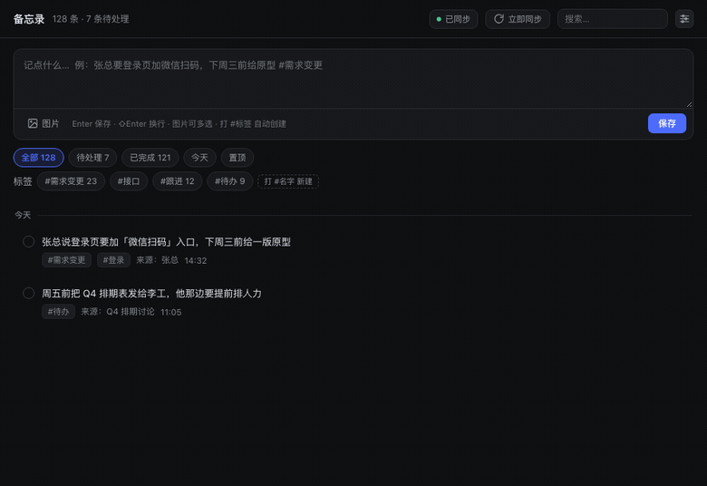
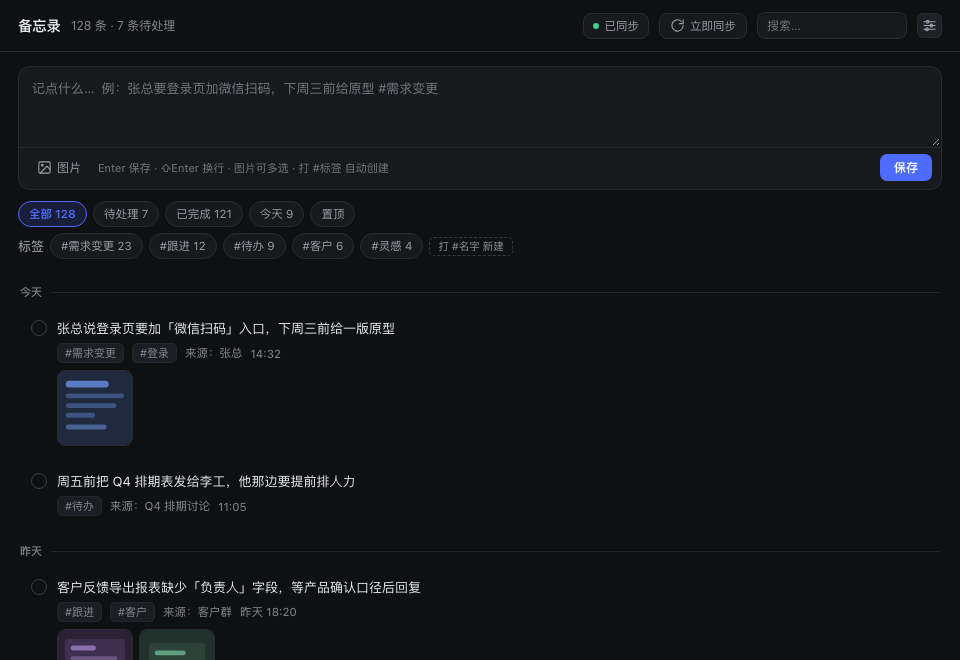
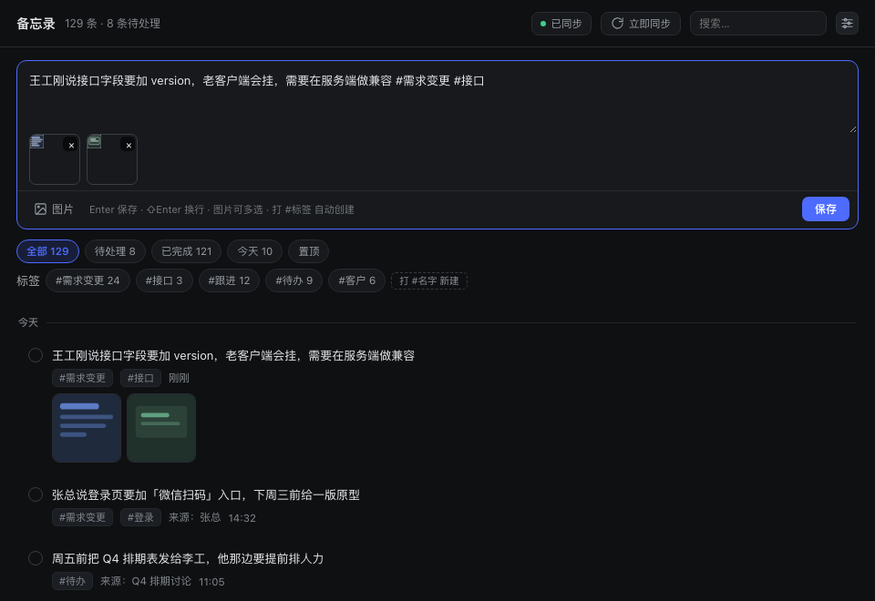
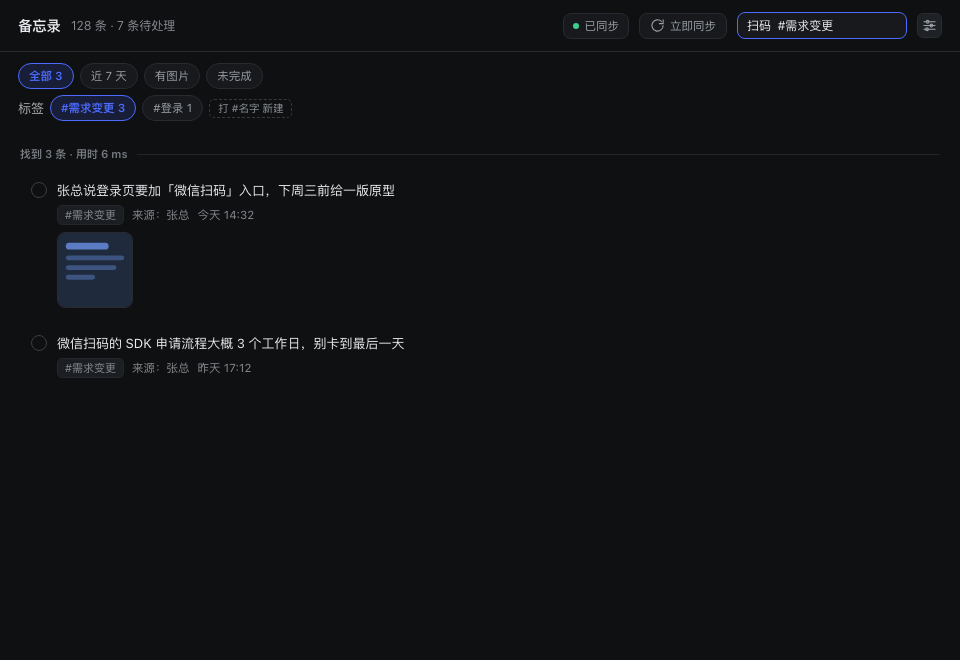
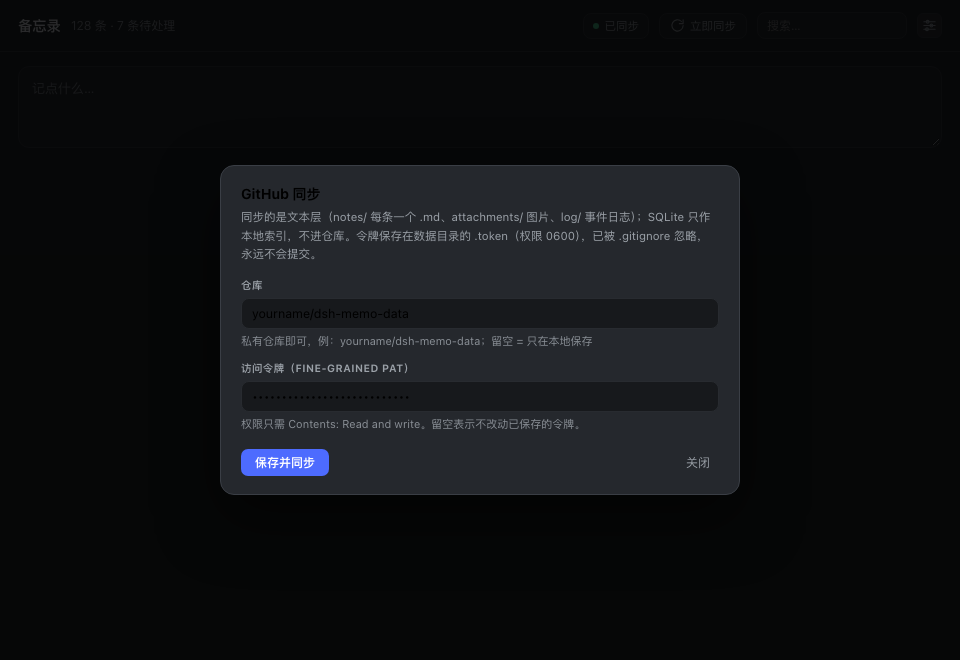

# dsh-memo

[English](README.md) | **中文**

**DeepSeek Harness 的备忘录插件** —— 侧边栏入口 + 快速记录，本地 SQLite 存储，同步到 GitHub 私有仓库，支持图片与截图。

> 为「聊天里突然冒出来的需求变更和临时待办」而做：**几秒记下来、事后找得回来、有上下文、不丢**。

<p align="center">
  <br>
  <sub>打字 → 回车 → 三十秒后自动出现在你的 GitHub 私有仓库里</sub>
</p>

| 主面板 | 记一条（可带图片） |
|:---:|:---:|
| [](docs/images/panel.png) | [](docs/images/compose.png) |
| **全文搜索** | **GitHub 同步设置** |
| [](docs/images/search.png) | [](docs/images/settings.png) |


---

## 特性

| | |
|---|---|
| **侧边栏入口** | 底部入口图标（与「设置」并列），带未处理角标，点击切换到备忘录面板 |
| **快速记录** | 面板顶部常驻输入框，`Enter` 即存；输入框可拖拽调整高度 |
| **图片与截图** | `⌘V` 粘贴 / 拖拽 / 文件选择（可多选）；按内容哈希去重，同一张图只存一份 |
| **可编辑** | 卡片就地展开编辑，正文与图片都能改；标签跟随正文里的 `#标签`，图片可逐张增删 |
| **标签** | 正文里打 `#任意名字` 保存即自动创建，不是固定白名单 |
| **置顶** | 置顶项排在列表最前，卡片上有图钉徽标 + 左侧色条，置顶按钮同步高亮 |
| **拖拽排序** | 同一天分组内按住卡片拖动即可调整先后，带位移过渡动画（内联 SortableJS） |
| **检索** | 中文子串搜索 + `#标签` / `来源:` / `after:` / `before:` / `has:图片` / `is:未完成` 限定词 |
| **本地存储** | `node:sqlite`（Node 内置），**零外部依赖**，无原生模块编译 |
| **GitHub 同步** | 文本层自动推送到私有仓库（变更后 30 秒防抖），含每日 SQLite 紧凑快照 |
| **零构建** | 客户端半侧是手写的模块 bundle，用 `React.createElement`，改完刷新即生效 |

---

## 安装

### 前置要求

- DeepSeek Harness（dsh）**0.2.0-rc.2 或更高**
- 其内置 Node **≥ 22.5**（`node:sqlite` 的最低版本；dsh 的 Electron 通常自带 24.x）
- 无第三方运行时依赖，不需要 `npm install`

### 方式一：从 npm 安装（推荐）

```sh
dsh plugin --profile <你的 profile> add @adamcjm/dsh-memo
```

`<你的 profile>` 是你的 dsh profile 名（如 `web`、`tui`）。安装后**重启 dsh** 生效。

### 方式二：从 GitHub 安装

固定到仓库默认分支的最新提交（而非已发布的版本）：

```sh
dsh plugin --profile <你的 profile> add github:adamcjm/dsh-memo
```

### 方式三：本地开发安装

```sh
git clone https://github.com/adamcjm/dsh-memo.git
dsh plugin --profile <你的 profile> add link:/path/to/dsh-memo
```

`link:` 方式下改动即时可见（客户端改动刷新页面，宿主端改动需重启）。

### 方式四：手动接入（desktop profile 专用）

**`desktop` profile 由 dsh 桌面应用独占管理，CLI 会拒绝写入**（报 `profile "desktop" is managed exclusively by the Electron application`）。这类 profile 需要手动接入：

1. 编辑 `~/.dsh/profiles/desktop/package.json`：

   ```jsonc
   {
     "dsh": {
       "profile": {
         "bundles": [
           // ... 已有的 bundle ...
           "@adamcjm/dsh-memo"                       // ← 追加
         ]
       }
     },
     "dependencies": {
       // ...
       "@adamcjm/dsh-memo": "^0.2.8"                // ← 追加
     }
   }
   ```

2. 安装依赖（建立符号链接）：

   ```sh
   cd ~/.dsh/profiles/desktop
   pnpm install
   ```

3. **重启 DeepSeek Harness**。

### 验证是否装上

```sh
dsh --profile <profile> --dump-config | grep -A3 "id: memo"
```

或直接看界面：侧边栏底部应出现「备忘录」图标。

---

## 使用

### 记一条

打开侧边栏底部的 **备忘录** 图标，在顶部输入框写下内容，按 `Enter` 保存：

```
张总说登录页要加微信扫码入口，下周三前给原型 #需求变更 #登录
```

保存后 `#需求变更`、`#登录` 会自动成为标签，正文里的标签记号会被清理掉。

### 修改一条

鼠标移到条目上，点 **编辑**（铅笔图标），条目会**原地展开**成编辑区：

- 直接改正文；正文里的 `#标签` 会同步为条目的标签（删掉正文里的标签，标签也就没了）
- 打开编辑时，条目已有的标签会以 `#标签` 的形式并回正文末尾 —— 看得见，也存得回
- 图片可逐张移除（缩略图右上角的 ×），也可随时新增（粘贴 / 拖拽 / 多选）
- `⌘Enter` 保存，`Esc` 取消

保存后事实源 `.md` 会重新生成、`rev` 递增，30 秒内自动同步到 GitHub。

### 调整顺序

同一天分组内，按住卡片直接拖动即可调整先后：

- 松手即保存，并写进事实源 `.md` 的 `order:` 字段，换设备同步后顺序不变
- **跨日期分组拖不过去**（「今天」的卡片拖不进「昨天」）；跨天想提前就用**置顶**
- 顺序只由拖拽和置顶决定：标记完成 / 取消完成、改正文都不会再把条目弹到顶部

### 加图片 / 截图

三种方式，可混用、可多次追加：

- **粘贴**：截图后在输入框里按 `⌘V`
- **拖拽**：从 Finder 直接拖图片到输入框
- **选择**：点「图片」按钮，文件选择器里按住 `⌘` / `⇧` 可多选

图片按 SHA-256 命名存入 `attachments/`，**同一张图贴两次只占一份空间**。点击缩略图可放大查看。

### 标签

标签**不是固定的**。默认的 `#需求变更` `#待办` `#跟进` `#灵感` `#会议` 只是起步建议：

- 正文里打 `#客户A`、`#张总` 保存 → 自动创建该标签并挂到这条备忘上
- 位置不限：开头、中间、末尾都行（`买牛奶#购物`、`开会，#工作` 也能识别）；标签名在空白或中英文标点处结束
- 标签区按使用次数排序，点击即筛选
- 某个标签再没有任何备忘在用时会自动隐藏

### 搜索

面板右上角搜索框，`Enter` 执行。支持组合限定词：

| 写法 | 含义 |
|---|---|
| `扫码` | 正文或来源包含该串（中文两字也能命中） |
| `#需求变更` | 按标签 |
| `来源:张总` | 按出处 |
| `after:2026-10-01` `before:2026-10-08` | 按时间范围 |
| `has:图片` | 只看带附件的 |
| `is:未完成` `is:已完成` | 只看待处理 / 已完成 |

### 快捷键

| 按键 | 作用 |
|---|---|
| `Enter` | 保存当前输入 |
| `⇧Enter` | 输入框内换行 |
| `⌘V` | 粘贴剪贴板里的图片 |
| `Esc` | 关闭弹层（设置 / 图片放大） |

### 同步到 GitHub

1. 在 GitHub 建一个**私有仓库**（例如 `yourname/dsh-memo-data`）
2. 生成访问令牌：
   - 推荐 **Fine-grained PAT**，只授权该仓库的 **Contents: Read and write**
   - 或经典 PAT，勾选 `repo`
3. 在插件面板右上角点 **设置图标**，填入仓库名与令牌，点「保存并同步」

之后：

- **手动同步**：点「立即同步」按钮，结果以顶部通知告知（成功 / 失败）
- **自动同步**：任何改动后 30 秒自动提交并推送；自动同步失败也会弹通知
- **状态显示**：面板头部显示「已同步 / 待同步 / 仅本地 / 同步异常」

### 仓库设置存在哪

优先级从高到低，三层兜底：

| 层 | 位置 | 说明 |
|---|---|---|
| ① | `~/.dsh/memo/.config.json` | 在插件设置界面里保存的，**重启后仍然生效** |
| ② | 插件配置 `cordis.patch.yml` 的 `config.repo` | 部署时的默认值 |
| ③ | `~/.dsh/memo/.git/config` 的 `remote.origin.url` | 目录里已有的 git 痕迹（手动 `git remote add` 过也能认出来） |

三层都查不到才会显示「未配置」。面板头部同步状态的 tooltip 会写明当前用的是哪一层（`runtime` / `config` / `git-remote`）。

令牌存储优先级（都不会进入仓库）：

1. 设置界面写入 `~/.dsh/memo/.token`（权限 `0600`）
2. 环境变量 `DSH_MEMO_GITHUB_TOKEN`
3. 环境变量 `GITHUB_TOKEN`

推送时令牌只出现在 git 进程参数（`http.extraheader`）里，**不写进 `.git/config`**。

---

## 数据与备份

数据根目录 `~/.dsh/memo/`，本身是一个 git 仓库：

```
~/.dsh/memo/
├── memo.db                  # SQLite 工作库（读写引擎，git 忽略，可从 notes/ 重建）
├── notes/2026-10/<id>.md    # ★ 文本事实源：每条备忘一个文件
├── attachments/<前2位>/<sha256>.<ext>   # 图片，内容哈希命名
├── log/2026-10.jsonl        # 追加式操作日志（.gitattributes 配了 merge=union）
├── snapshots/memo-YYYY-MM-DD.sqlite     # 每日紧凑快照，保留最近 7 份
├── .token                   # 凭据（0600，git 忽略）
├── .config.json            # 远程仓库设置（设置界面里保存的，随仓库一起同步）
├── .gitignore
└── .gitattributes
```

### 为什么 SQLite 不直接进 git

SQLite 在 git 里是一个**不可 merge 的二进制**：两台设备各改一次，git 只能整库二选一 —— 丢的是一台设备的**全部**记录，而不是一条；而且每改一条都会重写数据库页，一次小编辑就是一个完整新 blob，仓库会快速膨胀。

所以分成三层：

| 层 | 角色 | 失效后果 |
|---|---|---|
| ① 本地 SQLite | 读写引擎、索引 | 删掉即可从 ② 重建 |
| ② `notes/` + `attachments/` + `log/` | **同步真相**，git 同步的就是它 | 有 ③ 兜底 |
| ③ GitHub 私有仓库 | 备份 + 版本 | —— |

`snapshots/` 里每日的 `.sqlite` 也一并提交，满足「SQLite 文件也在 GitHub」；但它只作灾备、不参与合并。

### SQLite 丢失了怎么办

删掉 `memo.db*` 后重启 dsh（或调用 `rebuild` 接口），插件会扫描 `notes/**/*.md` 全量重建，包括标签、来源、截止日期与附件引用。

---

## 卸载

### 通过 CLI 安装的

```sh
dsh plugin --profile <你的 profile> remove @adamcjm/dsh-memo
```

### 手动接入的（desktop profile）

1. 编辑 `~/.dsh/profiles/desktop/package.json`，从 `dsh.profile.bundles` 与 `dependencies` 中删除 `@adamcjm/dsh-memo` 两项
2. `cd ~/.dsh/profiles/desktop && pnpm install`
3. 重启 DeepSeek Harness

### 可选：删除数据

卸载插件**不会**删除你的数据。确认不再需要时：

```sh
rm -rf ~/.dsh/memo          # 本地数据（含凭据）
```

如果同步过 GitHub，远端仓库（如 `yourname/dsh-memo-data`）需要你自行删除。

---

## 开发

```sh
git clone https://github.com/adamcjm/dsh-memo.git
cd dsh-memo

node test/smoke.mjs              # 宿主半侧 64 项：CRUD / 标签 / 附件 / 重建 / 快照 / 凭据
node test/client-precheck.mjs    # 客户端 22 项：模块协议 / slot 注册 / 组件渲染
node test/ui-feedback-check.mjs  # 界面细节 75 项（含置顶、拖拽接线）
node test/tag-rules-check.mjs    # 标签规则与编辑往返 52 项（位置 / 保真 / host-client 一致）
node test/reorder-check.mjs      # 顺序语义 20 项（完成不跳位 / 拖拽持久化 / 老库迁移）
node test/drag-check.mjs         # 真实浏览器拖拽 8 项（Chrome + CDP，没有 Chrome 自动跳过）
node test/panel-mount-check.mjs  # 面板真实挂载 7 项（jsdom + React，确认拖拽实例真的挂上了）
```

这些测试都**不需要启动 dsh**，直接跑。客户端测试需要能解析 `react` / `react-dom`（先从项目自身找，找不到则从 dsh profile 借）。

### 结构

```
package.json        dsh.bundle.patch + dsh.client（platform: web）
cordis.patch.yml    宿主插件行：id: memo
lib/index.js        宿主半侧：SQLite / 附件 / Markdown 事实源 / git 同步 / HTTP API
lib/client.js       客户端半侧：window.__ModuleLoader__.load({id, factory}) + React UI
                    （其中原样内联了 SortableJS 1.15.7 —— MIT，拖拽排序用）
test/               可独立运行的测试（宿主 / 客户端 / 界面 / 标签规则）
```

### 扩展点

- **客户端 → 宿主**：`fetch('/memo/api/<method>')`；宿主用 `ctx.webServer.register({ kind: 'prefix' })` 提供
- **侧边栏图标**：`ctx.slots.register({ name: 'sidebar.panellist', id, order, label }, Icon)`，图标组件收到 `{ size, active }`
- **主面板**：`ctx.slots.register({ name: 'main', key: id }, Panel)` —— **两者 id 必须相同**，点击图标时由外壳调用 `ctx.layout.selectPanel(id)`

### 改动如何生效

- **客户端（`lib/client.js`）**：刷新页面即可（模块系统按 mtime / ctime / size 派生 revision，支持热替换）
- **宿主端（`lib/index.js`）**：必须**重启 dsh**（进程启动时才加载）
- **`lib/client.js` 恰好在 dsh 启动瞬间被改写**：客户端 HMR 轮询可能在 bundle 首次加载尚未结束时热替换它，导致 DSH 把同一份脚本执行两次。bundle 现在容忍自身的重复注册（已存在注册时忽略第二次 `duplicate factory registration`），不会再让整个 web boot 失败；其它错误仍照常抛出

---

## 已知限制

- 只做文本层同步，**不做多设备并发合并 UI**（单设备前提下不会发生；文本层天然可 merge 作为保险）
- 无手机端界面
- 检索用 `LIKE` 而不是 FTS5 —— SQLite 的 `trigram` 分词器要求查询词 ≥3 字符，而中文最常用的两字检索（"扫码"）会静默返回空结果，正确性优先
- 图片按原图传输，不生成缩略图
- 不做系统级提醒（只有截止日期字段与到期展示）

## 许可

[MIT](LICENSE)
